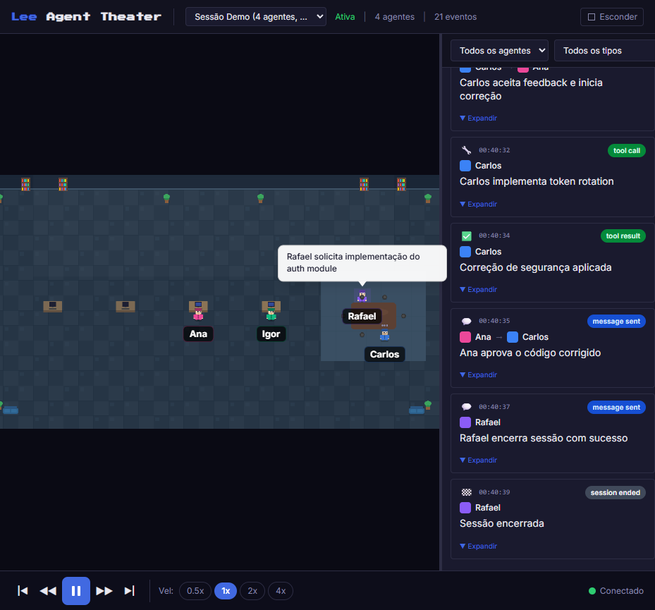

# Lee Agent Theater

> Um teatro visual de agentes de IA -- observe interacoes entre agentes Claude em tempo real, com personagens pixel art em um palco 2D.

**Lee Agent Theater** e uma aplicacao web local open source que funciona como um teatro observacional de agentes. O sistema le eventos de interacao entre agentes do ecossistema Claude/Anthropic e os representa graficamente em tempo real numa interface 2D estilo pixel art roguelike.

O projeto e **estritamente read-only** -- ele nunca interfere no ambiente monitorado, nunca cria agentes, nunca envia mensagens em nome dos agentes. Apenas observa e visualiza.



---

## Sumario

- [Funcionalidades](#funcionalidades)
- [Modo Demo](#modo-demo)
- [Stack Tecnologica](#stack-tecnologica)
- [Pre-requisitos](#pre-requisitos)
- [Instalacao](#instalacao)
- [Execucao](#execucao)
- [Scripts Disponiveis](#scripts-disponiveis)
- [Arquitetura](#arquitetura)
- [Estrutura do Projeto](#estrutura-do-projeto)
- [Sessões: Demo vs Claude Local](#sessoes-demo-vs-claude-local)
- [Adapters](#adapters)
- [Estados Visuais dos Agentes](#estados-visuais-dos-agentes)
- [Modelo de Evento](#modelo-de-evento)
- [API Local de Debug](#api-local-de-debug)
- [Documentação adicional](#documentacao-adicional)
- [Troubleshooting](#troubleshooting)
- [Roadmap](#roadmap)
- [Contribuicao](#contribuicao)
- [Licenca](#licenca)
- [English Summary](#english-summary)

---

## Funcionalidades

- **Palco 2D pixel art** com cenario em tiles e personagens animados
- **Animacao de interacao** -- agentes se movem ate o destinatario, exibem baloes de fala e retornam
- **8 estados visuais** distintos para cada agente (idle, active, moving, speaking, waiting, thinking, completed, error)
- **Painel lateral de historico** com timeline sincronizada ao palco
- **Atualizacao em tempo real** via WebSocket
- **Controles de reproducao** -- pause/play, velocidade, filtros por agente e sessao
- **Modo demo** funcional sem integracao real
- **Arquitetura extensivel** com adapters plugaveis para diferentes fontes de eventos
- **API REST local** para debug e inspecao

---

## Modo Demo

O Lee Agent Theater funciona **imediatamente** apos a instalacao, sem necessidade de configuracao ou integracao com o Claude. O `adapter-demo` gera eventos simulados automaticamente com interacoes realistas entre agentes, permitindo explorar toda a interface.

Para iniciar em modo demo, basta executar:

```bash
pnpm dev
```

O modo demo inclui:
- 3+ agentes simulados com roles distintos (architect, developer, reviewer, etc.)
- Eventos variados: mensagens, uso de ferramentas, mudancas de status, erros
- Cenarios de interacao realistas que demonstram todas as funcionalidades

---

## Stack Tecnologica

### Frontend (`apps/web`)
| Tecnologia | Uso |
|---|---|
| **React 18+** | Interface de usuario, paineis, controles |
| **TypeScript** | Tipagem estatica em todo o projeto |
| **Phaser 3** | Motor 2D para o palco teatral (sprites, animacoes, cenario) |
| **Tailwind CSS 4** | Estilizacao da UI React |
| **Zustand** | Gerenciamento de estado global (barramento React-Phaser) |
| **Vite** | Bundler e dev server |

### Backend (`apps/server`)
| Tecnologia | Uso |
|---|---|
| **Node.js 20+** | Runtime do servidor |
| **TypeScript** | Tipagem estatica |
| **Fastify** | Servidor HTTP |
| **@fastify/websocket** | Comunicacao em tempo real |
| **pino** | Logging estruturado |

### Compartilhado (`packages/core`)
| Tecnologia | Uso |
|---|---|
| **TypeScript** | Tipos e interfaces compartilhados |
| **Zod** | Validacao runtime de eventos |

### Tooling
| Ferramenta | Uso |
|---|---|
| **pnpm workspaces** | Gerenciamento do monorepo |
| **tsx** | Execucao TypeScript no server (dev) |
| **ESLint + Prettier** | Linting e formatacao |
| **Vitest** | Testes unitarios |

---

## Pre-requisitos

- **Node.js** 20 ou superior
- **pnpm** 9 ou superior
- Navegador moderno (Chrome 90+, Firefox 90+, Edge 90+)

---

## Instalacao

```bash
# Clonar o repositorio
git clone https://github.com/leerichard2000/lee-agent-theater.git
cd lee-agent-theater

# Instalar dependencias
pnpm install
```

---

## Execucao

```bash
# Iniciar em modo desenvolvimento (server + web simultaneamente, via Vite)
pnpm dev
```

Apos iniciar, abra o navegador em:
- **Frontend (Vite dev):** `http://localhost:5173`
- **Server:** `http://localhost:3001`
- **Health check:** `http://localhost:3001/api/health`

Fluxos alternativos:

- `pnpm dev:web` — sobe apenas o Vite (útil quando o server já está rodando).
- `pnpm dev:server` — faz `build` do web e sobe o server. O Fastify serve o
  bundle estático de `apps/web/dist/` em `http://localhost:3001/` (sem HMR).
  Use quando precisar validar o bundle de produção ou testar com Playwright
  apontando só para a porta 3001.

### Variáveis de ambiente relevantes

| Var | Default | Efeito |
|---|---|---|
| `SERVER_PORT` | `3001` | Porta HTTP/WS |
| `DEMO_ADAPTER` | `true` | `"false"` desliga a Sessão Demo |
| `CLAUDE_LOCAL_ADAPTER` | `true` | `"false"` desliga o adapter Claude Local |
| `CLAUDE_POLL_INTERVAL_MS` | `2000` | Intervalo de polling de `~/.claude/teams` |

---

## Scripts Disponiveis

Executados na raiz do projeto:

| Script | Descricao |
|---|---|
| `pnpm dev` | Inicia server e web simultaneamente em modo desenvolvimento |
| `pnpm dev:web` | Inicia apenas o frontend (Vite) |
| `pnpm dev:server` | Inicia apenas o servidor (Fastify) |
| `pnpm build` | Compila todos os pacotes para producao |
| `pnpm build:web` | Compila apenas o frontend |
| `pnpm build:server` | Compila apenas o servidor |
| `pnpm lint` | Executa linting em todo o monorepo |
| `pnpm typecheck` | Verificacao de tipos TypeScript |
| `pnpm clean` | Remove artefatos de build de todos os pacotes |

---

## Sessões: Demo vs Claude Local

O Lee Agent Theater suporta duas fontes de eventos simultaneamente, cada
uma expondo uma sessão distinta no seletor da UI:

| Sessão | Adapter | Fonte | Estado visual |
|---|---|---|---|
| **Sessão Demo** | `adapter-demo` | Scripts curados (`FEATURE_SCENARIO` em `packages/adapters/adapter-demo/src/index.ts`) | Animação completa: movimentação até a mesa de reunião + balões |
| **Claude: `<team>`** | `adapter-claude-local` | `~/.claude/teams/<team>/` + `~/.claude/tasks/<team>/` em tempo real (polling + file watch) | Animação funcional mas com limitações (ver [docs/adapters.md](docs/adapters.md)) |

Para alternar, use o seletor de sessão no cabeçalho da UI. Ao testar
mudanças em animação, escolha uma sessão válida (ex.: `forge-labs`) — o
comportamento entre Demo e sessões reais difere.

Para desligar uma fonte durante desenvolvimento:

```bash
CLAUDE_LOCAL_ADAPTER=false pnpm dev   # só Demo
DEMO_ADAPTER=false pnpm dev           # só Claude Local
```

---

## Arquitetura

O projeto segue uma arquitetura **event-driven unidirecional**: fontes externas (adapters) emitem eventos padronizados, o servidor os centraliza e distribui via WebSocket, e o frontend consome e renderiza.

> **Visão detalhada:** [docs/architecture.md](docs/architecture.md) cobre o
> layout real do monorepo, fluxo end-to-end, contratos de `@theater/core`
> e API REST. Para a cena Phaser, ver [docs/phaser-scene.md](docs/phaser-scene.md).
> Para adapters, [docs/adapters.md](docs/adapters.md).

### Diagrama de Fluxo

```
┌─────────────────────────────────────────────────────────────┐
│                     FONTES EXTERNAS                         │
│  Claude Hooks  |  Anthropic SDK  |  MCP Server  |  Logs    │
└───────┬────────┴────────┬────────┴───────┬──────┴────┬─────┘
        │                 │                │           │
        v                 v                v           v
┌─────────────────────────────────────────────────────────────┐
│                    CAMADA DE ADAPTERS                        │
│  Cada adapter:                                               │
│  1. Captura dados brutos da fonte                            │
│  2. Normaliza para TheaterEvent                              │
│  3. Valida com Zod                                           │
│  4. Envia via HTTP POST para o server                        │
└────────────────────────┬────────────────────────────────────┘
                         │ POST /api/events
                         v
┌─────────────────────────────────────────────────────────────┐
│                    SERVER (Fastify)                           │
│                                                              │
│  ┌────────────┐  ┌────────────────┐  ┌──────────────────┐  │
│  │ REST API   │  │ SessionManager │  │ AdapterRegistry  │  │
│  │ /api/*     │  │ (estado em     │  │ (lifecycle dos   │  │
│  │ (debug)    │  │  memoria)      │  │  adapters)       │  │
│  └────────────┘  └───────┬────────┘  └──────────────────┘  │
│                          │                                   │
│                  ┌───────v────────┐                          │
│                  │  WebSocket Hub │                          │
│                  │  (broadcast    │                          │
│                  │   por sessao)  │                          │
│                  └───────┬────────┘                          │
└──────────────────────────┬──────────────────────────────────┘
                           │ ws://localhost:3001/ws
                           v
┌─────────────────────────────────────────────────────────────┐
│                  FRONTEND (React + Phaser)                    │
│                                                              │
│  ┌───────────────────────────────────────────────────────┐  │
│  │                  Zustand Store                         │  │
│  │  eventStore: buffer circular de TheaterEvent           │  │
│  │  sessionStore: sessao ativa, agentes, status WS        │  │
│  └──────────┬────────────────────────────┬───────────────┘  │
│             │                            │                   │
│   ┌─────────v──────────┐      ┌──────────v──────────────┐  │
│   │   Camada React     │      │    Camada Phaser 3      │  │
│   │   - Paineis        │      │    - TheaterScene       │  │
│   │   - Timeline       │      │    - AgentSprites       │  │
│   │   - Controles      │      │    - Animacoes          │  │
│   │   - Filtros        │      │    - Baloes de fala     │  │
│   └────────────────────┘      └─────────────────────────┘  │
└─────────────────────────────────────────────────────────────┘
```

### Principios Arquiteturais

1. **Extensibilidade via adapters** -- novas fontes de dados = novo adapter, sem tocar no core
2. **Contrato de evento unico** -- todos os adapters emitem `TheaterEvent` validado por Zod
3. **Separacao Phaser/React** -- Phaser cuida da cena 2D, React cuida da UI, Zustand e o barramento
4. **Read-only por design** -- nenhum adapter pode realizar escrita no ambiente observado
5. **Estado em memoria** -- sem banco de dados no MVP, ring buffer de 1000 eventos por sessao

### Decisoes Arquiteturais

| Decisao | Justificativa |
|---|---|
| pnpm workspaces | Simplicidade, suporte nativo, disk efficiency |
| TheaterEvent como unidade fundamental | Simplifica o pipeline, permite replay |
| Adapters comunicam via HTTP POST | Mais simples que WebSocket bidirecional; adapters podem ser scripts simples |
| PhaserBridge via Zustand | Phaser roda em game loop proprio sem depender do ciclo React |
| Zod como validador unico | Runtime + compiletime, type inference nativa |
| Estado em memoria (Map + ring buffer) | Suficiente para MVP local; extensivel para SQLite no futuro |

---

## Estrutura do Projeto

```
lee-agent-theater/
├── pnpm-workspace.yaml
├── package.json                   # scripts raiz: dev, build, lint, typecheck
├── tsconfig.base.json             # config TS compartilhada
│
├── apps/
│   ├── web/                       # Frontend React + Phaser 3
│   │   ├── package.json
│   │   ├── vite.config.ts
│   │   └── src/
│   │       ├── main.tsx           # entrypoint React
│   │       ├── App.tsx
│   │       ├── components/        # paineis, HUD, controles
│   │       ├── game/              # cena Phaser, sprites, animacoes
│   │       │   ├── TheaterScene.ts
│   │       │   ├── AgentSprite.ts
│   │       │   └── PhaserBridge.ts
│   │       ├── stores/            # Zustand stores
│   │       └── hooks/             # React hooks (useWebSocket, etc.)
│   │
│   └── server/                    # Backend Node + Fastify
│       ├── package.json
│       └── src/
│           ├── index.ts           # bootstrap Fastify + WebSocket
│           ├── routes/            # REST API (debug)
│           ├── ws/                # gerenciamento WebSocket
│           ├── session/           # SessionManager
│           └── adapters/          # AdapterRegistry
│
├── packages/
│   ├── core/                      # Tipos, contratos, validacao
│   │   ├── package.json           # @theater/core
│   │   └── src/
│   │       ├── events.ts          # TheaterEvent, EventType, schemas Zod
│   │       ├── session.ts         # SessionState, AgentInfo
│   │       └── validation.ts      # validacao com Zod
│   │
│   └── adapters/                  # Adapters individuais
│       ├── adapter-demo/          # eventos simulados (MVP)
│       ├── adapter-claude-hooks/  # Claude Code hooks
│       ├── adapter-claude-sdk/    # Anthropic SDK
│       ├── adapter-mcp/           # MCP Server
│       └── adapter-file-log/      # leitura de logs
│
└── docs/                          # documentacao extra
```

---

## Adapters

Adapters sao a camada de integracao do Lee Agent Theater. Cada adapter captura dados de uma fonte externa, normaliza para o formato `TheaterEvent` e envia ao servidor via HTTP POST.

| Adapter | Descricao | Status |
|---|---|---|
| `adapter-demo` | Gera eventos simulados a partir de scripts curados | Funcional |
| `adapter-claude-local` | Lê `~/.claude/teams/<team>/` e `tasks/<team>/` em tempo real | Funcional |
| `adapter-claude-hooks` | Captura eventos via Claude Code hooks (PostToolUse, Stop, etc.) | Placeholder |
| `adapter-claude-sdk` | Intercepta chamadas do Anthropic SDK | Placeholder |
| `adapter-mcp` | Escuta eventos de servidores MCP | Placeholder |
| `adapter-file-log` | Le logs de arquivo em formato JSON lines | Placeholder |

Para o contrato de adapter, walkthrough detalhado de `adapter-claude-local`
(descoberta de times, filtros de inbox, resolução de aliases, sanitização) e
template de adapter novo, ver [docs/adapters.md](docs/adapters.md).

### Criando um novo adapter

Todo adapter implementa a interface `TheaterAdapter` definida em `@theater/core`:

```typescript
import { BaseAdapter, type AdapterConfig, type TheaterEvent } from '@theater/core';

export class MeuAdapter extends BaseAdapter {
  readonly config: AdapterConfig = {
    id: 'meu-adapter',
    name: 'Meu Adapter Customizado',
    serverUrl: 'http://localhost:3001',
  };

  async start(): Promise<void> {
    this.running = true;
    // Iniciar captura de eventos da sua fonte
  }

  async stop(): Promise<void> {
    this.running = false;
    // Cleanup de recursos
  }
}
```

O metodo `emit()` herdado de `BaseAdapter` valida o evento com Zod e envia ao servidor automaticamente.

---

## Estados Visuais dos Agentes

Cada agente no palco pode estar em um dos seguintes estados, com feedback visual distinto:

| Estado | Descricao | Visual |
|---|---|---|
| `idle` | Agente em repouso, sem atividade | Sprite estatico, cor neutra |
| `active` | Agente ativo processando | Destaque sutil, indicador de atividade |
| `moving` | Agente se deslocando no palco | Animacao de caminhada |
| `speaking` | Agente emitindo mensagem | Balao de fala visivel |
| `waiting` | Agente aguardando resposta | Animacao de espera (ex: reticencias) |
| `thinking` | Agente processando/raciocinando | Indicador de pensamento |
| `completed` | Agente finalizou sua tarefa | Indicador de conclusao |
| `error` | Agente encontrou um erro | Destaque em vermelho |

---

## Modelo de Evento

Todo dado que transita no sistema segue o contrato `TheaterEvent`:

```typescript
interface TheaterEvent {
  id: string;                              // UUID v4
  timestamp: string;                       // ISO 8601
  sessionId: string;                       // ID da sessao
  sourceAgent: AgentInfo;                  // agente emissor
  targetAgent: AgentInfo | null;           // agente destinatario (null = broadcast)
  eventType: EventType;                    // tipo do evento
  summary: string;                         // resumo curto (max 280 chars, para baloes)
  content: string;                         // conteudo completo (para painel)
  status: EventStatus;                     // status do evento
  metadata: Record<string, unknown>;       // metadados livres
}
```

### Tipos de evento suportados

| Tipo | Descricao |
|---|---|
| `message_sent` | Mensagem enviada entre agentes |
| `message_received` | Mensagem recebida por um agente |
| `agent_joined` | Agente entrou na sessao |
| `agent_left` | Agente saiu da sessao |
| `tool_call` | Agente chamou uma ferramenta |
| `tool_result` | Resultado de chamada de ferramenta |
| `thinking` | Agente esta raciocinando |
| `error` | Evento de erro |
| `status_change` | Mudanca de status de um agente |
| `session_started` | Sessao iniciada |
| `session_ended` | Sessao encerrada |
| `custom` | Evento customizado |

---

## API Local de Debug

O servidor expoe uma API REST para inspecao e debug:

| Metodo | Rota | Descricao |
|---|---|---|
| `GET` | `/api/health` | Health check, versao e uptime |
| `POST` | `/api/events` | Recebe TheaterEvent de adapters |
| `GET` | `/api/sessions` | Lista todas as sessoes |
| `GET` | `/api/sessions/:id` | Detalhes de uma sessao |
| `GET` | `/api/sessions/:id/events` | Eventos da sessao (paginado: `?limit=50&offset=0`) |
| `POST` | `/api/sessions` | Cria sessao manualmente |
| `PATCH` | `/api/sessions/:id` | Atualiza status da sessao |
| `GET` | `/api/status` | Status geral (uptime, memória, clients WS, lista de sessões) |
| `GET` | `/api/agents?sessionId=…` | Agentes de uma sessão |

> As rotas `/api/sessions` e `/api/adapters` citadas em versões antigas do
> projeto **não** estão implementadas. Sessões são criadas implicitamente
> pelo `SessionStore` quando um evento chega, e adapters são instanciados
> estaticamente no bootstrap do server (ver [docs/adapters.md](docs/adapters.md)).

---

## Documentação adicional

Docs vivos em `docs/`:

| Arquivo | Conteúdo |
|---|---|
| [docs/architecture.md](docs/architecture.md) | Layout do monorepo, fluxo end-to-end de um evento, contratos de `@theater/core`, API REST, env vars |
| [docs/phaser-scene.md](docs/phaser-scene.md) | Internals da `TheaterScene`: constantes, queue de animação, `animateConversation`/`animateBroadcast`/`animateSimpleEvent`, sprites |
| [docs/adapters.md](docs/adapters.md) | Contrato de adapter, walkthrough do `adapter-demo` e `adapter-claude-local`, template para adapter novo |
| [docs/test-plan.md](docs/test-plan.md) | Plano de QA: mapa de funcionalidades, cenários P0/P1/P2 e critérios de aceitação |
| [docs/test-results.md](docs/test-results.md) | Resultados de execução de QA com status PASS/FAIL/PENDING por cenário |
| [CHANGELOG.md](CHANGELOG.md) | Mudanças resumidas por release (formato Keep a Changelog) |
| [PATCH_NOTES.md](PATCH_NOTES.md) | Histórico detalhado por patch (decisões, causa raiz, verificação) |
| [CONTRIBUTING.md](CONTRIBUTING.md) | Guia de contribuição |
| [CODE_OF_CONDUCT.md](CODE_OF_CONDUCT.md) | Código de conduta da comunidade |

---

## Roadmap

### Fase 1 -- Fundacao (MVP)
- [x] Monorepo pnpm workspaces
- [x] Backend Fastify + WebSocket
- [x] Frontend React + Vite
- [x] Tipagem compartilhada (`@theater/core`)
- [x] Adapter demo funcional
- [x] Comunicacao em tempo real

### Fase 2 -- Palco Visual
- [ ] Cenario pixel art com tiles
- [ ] Sprites distintos por agente
- [ ] 8 estados visuais com feedback claro
- [ ] Animacao de movimentacao emissor-receptor
- [ ] Baloes de fala
- [ ] Destaque do agente ativo

### Fase 3 -- Historico e Controles
- [ ] Painel lateral com timeline sincronizada
- [ ] Filtros por agente e sessao
- [ ] Controle pause/play
- [ ] Controle de velocidade de animacao
- [ ] Evento ativo destacado no painel e no palco

### Fase 4 -- Adapters Reais
- [ ] Adapter para Claude Code Hooks
- [ ] Adapter para Anthropic SDK
- [ ] Adapter para MCP (opcional)
- [ ] Adapter para leitura de logs

### Futuro
- [ ] Persistencia de sessoes (SQLite)
- [ ] Replay de sessoes gravadas
- [ ] Temas visuais alternativos
- [ ] Suporte a mais de 8 agentes simultaneos
- [ ] Internacionalizacao (i18n)

---

## Contribuicao

Contribuicoes sao muito bem-vindas! Consulte o [CONTRIBUTING.md](CONTRIBUTING.md) para informacoes detalhadas sobre como contribuir.

Resumo rapido:

1. Faca um fork do repositorio
2. Crie uma branch para sua feature (`git checkout -b feature/minha-feature`)
3. Faca commit das suas alteracoes (`git commit -m 'feat: adiciona minha feature'`)
4. Faca push para a branch (`git push origin feature/minha-feature`)
5. Abra um Pull Request

---

## Troubleshooting

Problemas comuns observados no dia a dia do projeto. Se algum deles
não estiver aqui, abra uma issue com logs e passos para reproduzir.

### `ERR_MODULE_NOT_FOUND` em módulos que existem no disco

- **Sintoma:** `pnpm dev` ou `pnpm dev:server` falha com
  `ERR_MODULE_NOT_FOUND` apontando para um arquivo `.js` dentro de
  `node_modules/` que, ao olhar no disco, **existe** (ou existia até
  minutos atrás).
- **Causa:** sync do OneDrive no Windows remove esporadicamente arquivos
  `.js` de dentro de `node_modules/` e de `packages/*/dist/`. Ver
  PATCH_NOTES [v0.11.5](PATCH_NOTES.md) e [v0.13.4](PATCH_NOTES.md).
- **Solução rápida:** apagar e reinstalar.
  ```bash
  rm -rf node_modules
  pnpm install
  pnpm -r build
  ```
- **Solução definitiva:** mover o projeto para fora do OneDrive (ex.:
  `C:\dev\lee-agent-theater`) ou excluir `node_modules` da sync via
  File Explorer → clique direito → "Always keep on this device" +
  configurar exclusão de pasta nas preferências do OneDrive.

### `pnpm dev:server` servindo tela branca

- **Sintoma:** `http://localhost:3001` abre mas renderiza em branco, sem
  erro aparente. `http://localhost:5173` (Vite) funciona normalmente.
- **Causa:** bundle em `apps/web/dist/` stale ou corrompido — o
  `index.html` referencia um `.js` em `assets/` que sumiu (OneDrive
  novamente) ou é de uma build antiga incompatível.
- **Defesa atual:** o server valida o bundle via `inspectWebDist()`
  ([apps/server/src/index.ts](apps/server/src/index.ts)) antes de servir.
  Se o bundle está inválido, o Fastify loga erro claro e **não** registra
  o `fastify-static`, em vez de servir silenciosamente (v0.13.4).
  `pnpm dev:server` também faz `pnpm --filter @theater/web build` antes
  de subir o server.
- **Se persistir:** force rebuild.
  ```bash
  rm -rf apps/web/dist
  pnpm --filter @theater/web build
  pnpm dev:server
  ```

### Nada aparece no palco mesmo com sessão ativa

Checklist de triagem, na ordem:

1. **Console do browser (F12 → Console):** procure erros de JS. Erros
   de `Phaser` ou `Zustand` geralmente indicam bundle inconsistente (ver
   item anterior).
2. **Sessão selecionada:** confirme no dropdown do cabeçalho se está em
   uma sessão válida. Para adapter-claude-local é `Claude: <team>`
   (ex.: `Claude: forge-labs`). Para demo, `Sessão Demo`.
3. **Events no server:** rode o curl abaixo. Deve retornar 200 e pelo
   menos 1 evento.
   ```bash
   curl "http://localhost:3001/api/events?sessionId=<id>&limit=1"
   ```
   Se der 404: a sessão não existe no `SessionStore`. Para Demo, o
   sessionId é `demo-session`. Para Claude Local, `claude-<teamName>`
   (ver [docs/adapters.md](docs/adapters.md)).
4. **WebSocket:** no Network → WS, confirme uma conexão ativa em `/ws`
   com mensagens trafegando. Se estiver `disconnected`, reinicie o server.
5. **Sessões reais (Claude Local) vs Demo:** hoje há limitações
   conhecidas em animação de conversa para sessões Claude Local (ver
   [docs/adapters.md](docs/adapters.md) — seção "Limitações conhecidas").
   Use a Sessão Demo para validar a pipeline visual ponta a ponta.

---

## Licenca

Este projeto esta licenciado sob a [Licenca MIT](LICENSE).

---

## English Summary

**Lee Agent Theater** is a local open-source web application that serves as a visual theater for AI agents. It observes and displays real-time interactions between Claude/Anthropic agents through a 2D pixel-art stage interface.

**Key features:**
- 2D pixel-art stage with animated agent characters
- Real-time WebSocket updates
- Event history panel with synchronized timeline
- Playback controls (pause/play, speed, filters)
- Extensible adapter architecture for multiple event sources
- Demo mode that works out of the box

**Quick start:**
```bash
git clone https://github.com/leerichard2000/lee-agent-theater.git
cd lee-agent-theater
pnpm install
pnpm dev
```

The application is **strictly read-only** -- it never interferes with the monitored environment. For full documentation, see the sections above (in Portuguese).
